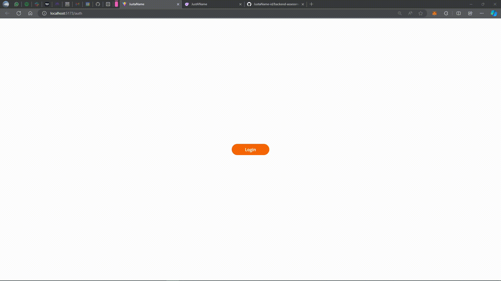

### Demonstration:

<div style="text-align:center;">
  
</div>

### How to Run:

1. Clone the repository:
    ```sh
    git clone https://github.com/georgesMouawad/backend-assessment-001.git
    ```
2. Navigate to the 'client' directory, install NPM packages and run:
    ```sh
    cd client
    npm i
    npm run
    ```
3. Navigate to the 'api' directory, install NPM packages and run:
    ```sh
    cd api
    npm i
    npm run start
    ```